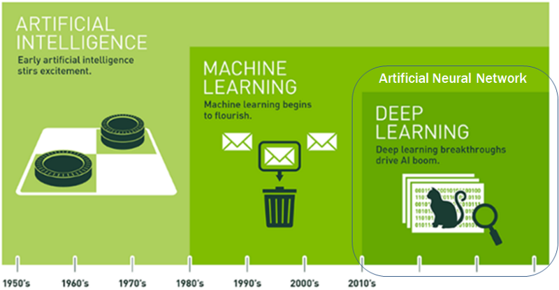

# IoT-dataanalysis-2025
2025 IoT 개발자 과정 빅데이터분석 리포지토리

## 1일차

### 머신러닝/딥러닝


(출처 : NVIDIA)  


- 인공지능(Artificial Intelligence: AI)의 분야
    - 컴푸터가 사람의 행동을 흉내내는 모든 기술

- 머신러닝
    - 인공지능 하위 집합
    - 통계적 방법을 이용, 기계를 학습시키는 인공지능 기술

- 딥러닝
    - 머신러닝의 하위 집합
    - 신경망 기술을 이용, 머신러닝 기술 중 하나

- 인공지능 역사
    - 1943 - 월터 피츠, 워랜 맥컬러가 MCP뉴런 
    - 1950 - 튜링(엘런 튜링) 테스트, 인공지능 테스트
    - 1957 - 퍼셉트론 이론 
    - 1974 - 1차 AI겨울. 컴퓨터 성능 한계
    - 1980 - AI붐. 전문가 시스템(머신러닝)
    - 1987 - 2차 AI겨울. 전문가 시스템 실패
    - 2010 - 컴퓨팅 HW환경 비약적 발전. AI희망 
    - 2015 - 텐서플로 발표 
    - 2016 - 알파고

### 개발환경
#### 코랩 
- Google Colaboratory, 2017년 발표
- 구글에서 만든 온라인 주피터 노트북 개발 플랫폼
- 구글 드라이브 연동, 구글 서버 하드웨어 사용
    - 드라이브 ColabNotebooks 폴더에 저장
- 어디서나 파이썬 학습, 개발등 가능
- https://colab.research.google.com/?hl=ko
- 런타임 유형
    - CPU, T4 GPU, V2-8 TPU - 무료
    - A100 GPU, L4 GPU, v5e-1 TPU - 유료 
- 무료에서는 80분 넘어서면 세션이 끊어짐
#### VScode
- 로컬 직접 환경 설정
- 사이킷런, 텐서플로, 쿠다, 파이토치...

##### 파이썬 가상환경
- 가상환경 생성 명령어
```shell
> python -m venv [가상환경이름]
```
- 가상환경 실행 명령어
```shell
> .\[가상환경이름]\Scripts\activate
```

- .gitignore에 /mlvenv 추가 후 깃허브 우선 푸시

</br>


- matplotlib 설치
```shell
> pip install matplotlib
```


- seaborn 모듈(matplotlib 하위 모듈) 설치
```shell
> pip install seaborn
```
- matplotlib , seaborn 한글 설정
```python
import matplotlib.pyplot as plt
import seaborn as sns

# 한글로 Matplotlib 사용시 항상 필요
from matplotlib import rcParams, font_manager, rc

font_path = 'C:/Windows/Fonts/malgun.ttf' 
font = font_manager.FontProperties(fname=font_path).get_name()  # 실제 설치된 폰트 이름조회
rc('font', family=font)                                         # 한글깨짐현상 해결!!
rcParams['axes.unicode_minus'] = False                          # 한글 사용시 마이너스 표시 깨짐 해결!
sns.set_style('darkgrid')                                               ## seaborn 스타일 설정
sns.set_theme(font='Malgun Gothic', rc={'axes.unicode_minus': False})   ## seaborn 한글 깨짐 해결
```

- scikit-learn 설치
```shell
> pip install scikit-learn
```

- 텐서플로우 설치 - cp버전
```shell
> pip install tensorflow==2.15.0
```

### 첫번째 머신러닝
- kaggle 생선 데이터
    - https://www.kaggle.com/datasets/vipullrathod/fish-market

- 길이를 보고 도미(bream)인지 방어(smelt)인지 판별
- 이진 분류(Binary Classification)

- [[노트북]](./day01/mldl01_도미빙어분류.ipynb)

### 지도 학습/ 비지도 학습
- 지도학습(supervised learn) - 데이터 -> `입력`, 정답 -> `타겟` => 훈련 데이터(training data)
    - 입력 - 특성 
    - 입력과 타겟을 모두 주어서 훈련을 시키는 것
- 비지도 학습(unsupervised learen) - 입력만 존재하고 타겟 없이 훈련하는 것
- 강화 학습(reinforcement learn) - 선택가능한 행동 중 보상과 처벌 등으로 최적의 행동양식을 학습하는 것

#### 훈련 세트/ 테스트 세트
- 훈련 세트 - 모델을 훈련시키기 위한 데이터
- 테스트 세트 - 훈련 후 모델이 예측을 제대로 하는지 테스트하는 데이터

- 전체 데이터 70~80 분리 후 훈련 세트로, 20~30 퍼센트를 테스트 세트 사용

#### 샘플링 편향
- 49개 데이터를 7:3으로 분리하면 
    - 34마리가 전부 도미로 훈련 데이터
    - 1마리 도미 + 14마리 빙어로 테스트 세트

- 위 문제를 해결하기 위해서 데이터를 랜덤하게 섞음 (shuffle)

#### 넘파이
- 수학 라이브러리 일종. 파이썬에서 배열처리 쉽게 도와주기 위해 개발
- 2차원 배열이상 고차원 배열 조작 처리 간편한 도구

- [노트북](./day01/mldl02_훈련테스트세트.ipynb)

## 2일차

### 빅데이터에 필요한 모듈
- Numpy(배열), Pandas(데이터 조작)
- Matplotlib(차트), Seaborn(차트꾸미기) 
- Folium(지도), Faker(더미데이터 생성)

- [노트북](./day02/mldl01_주요모듈학습.ipynb)


### 데이터 전처리
- 머신러닝/딥러닝 이전에 데이터 가공

- [노트북](./day02/mldl02_데이터전처리.ipynb)


### 선형회귀
- 회귀(Regression) : 두 변수 사이의 상관관계를 분석하는 방법
    - 임의의 수치를 예측하는 문제
- `과대적합` - overfit. 모델 훈련세트 성능이 테스트 세트 성능보다 훨씬 높을때.
- `과소적합` - underfit. 훈련세트 성능 낮거나, 테스트 세트 성능이 너무 높을때.


- K-최근접 이웃 회귀 알고리즘 문제점 확인

- [노트북](./day02/mldl03_선형회귀.ipynb)

- 선형회귀 중 직선(1차 방정식)의 문제점 확인

## 3일차

### 선형회귀 중 다항회귀
#### 선형회귀 중 단한회귀 문제점
- 예측값이 마이너스가 나오는 경우 발생(물고기 무게 등)

#### 다항회귀
- 단항회귀 문제를 해결
- 무게 = a x 길이^2 + b x 길이 + c
    - 회귀선이 곡선으로 표현

- [노트북](./day02/mldl03_선형회귀.ipynb#Polynomial-Regression(다항회귀))

#### 특성공학
- 훈련시킬 특성이 모자랄때 기존 특성을 조합해서 새로운 특성을 만드는 과정
- `sklearn.preprocessing.PolynomialFeatures` 를 사용해서 특성을 추가
- `하이퍼파라미터` - 머신러닝, 딥러닝에서 학습하지 않는 파라미터
    - 사람이 직접, 저장하는 값
    - random_state, learning_rate, ...
    

### 로지스틱회귀
- 선형(다항)회귀 - 특성을 입력해서 타겟값을 예측
- 로지스틱회귀 - K-NearstNeighbor 분류처럼 분류 알고리즘
    - 분류를 확율로 예측

- K-최근접 이웃 분류 알고리즘
    - 다중 분류가 어려움
    - 범위를 벗어난 데이터는 예측에 불리

- 선형 방정식으로 학습
    - 무게, 길이, 대각선길이, 높이, 두께 특성
    - z = a x 무게 + b x 길이 + c x 대각선 길이 + d x 높이 + e x 두께 + f
    - z : 0~1(0~100%)

#### 활성화함수
- 활성화함수 - 입력신호를 출력신호롤 변환시켜주는 함수
    - `시그모이드 함수` - z가 아주 큰 음수일 때 0으로, 아주 큰 양수일 때 1로 바꿔주는 함수

        

    - `소프트맥스 함수` -  다중 분류에서 z 값을 확률로 만들어 주는 함수

- [노트북](./day03/mldl01_로지스틱회귀.ipynb)

- 현재까지 K-NN분류, 선형회귀, 로지스틱회귀 학습
#### 머신러닝이 많이 활용되는 분야
- 인터넷 쇼핑/이커머스
    - 추천 시스템 :  유저 행동을 분석해서 상품 추천
    - 가격 최적화 : 수요에 맞게 가격을 자동 조정
    - 고객 이탈 예측 : 고객이 언제 서비스를 떠날지 예측하고 방지

- 금융서비스 범죄쪽 예측
    - 신용점수 평가, 이상거래 탐지, 보험사기 예측

- 제조/공정 자동화(스마트팩토리)
    - 불량품탐지(Vision) : 카메라 이미지로 실시간 불량 예측
    - 예지보전 : 기계 고장을 사전에 예측. 미리 수리
    - 생산 최적화 : 공정을 손봐서 품질 향상 자동화

- 의료/헬스케어
    - 질병예측
    - 의료 영상분석 : CT, MRI 자동 종양탐지

- 자율주행/로봇
    - 객체인식 및 추적 : 카메라, 라이다로 차량, 사람인식
    - 경로 계획 : 최적 주행경로 계산
    - 행동 예측 : 앞차나 보행자의 움직임을 예측

- 보안 
    - 침입탐지시스템, 악성코드분류, 화재인식


### 확률적 경사하강법
- `확률적 경사 하강법` (Stochastic Gradient Descent)를 사용하는 이유
    - 데이터가 너무 많을 때 시간절약
    - 로컬 미니마(지역 최소점) 문제 해결
    - 데이터가 계속 쌓이면, 이전 모델에 사용된 데이터 필요하고 새 데이터도 필요
    - 모든 데이터로 학습을 하면 시간이 낭비
- 빠르게, 적은 자원으로 자주 업데이트하면서 좋은 결과를 도출할 수 있도록 찾아낸 방법

- SGD 설명 정리
    - 모든 데이털르 가지고 손실 함수 최소값 찾는 것이 아닌
    - 데이터를 일정 간격으로 뛰어 넘으면서 손실함수 최소값 찾는 횟수를 줄이는 것

- `에포크`(epoch)
    - SGD로 훈련세트를 한번 다 사용한 과정. 반복횟수

- 경사하강법 종류
    - `확률적 경사하강법` : 주어진 간격대로 1개씩 꺼내서 하강하는 방법
        - `batch_size` 1, 한 개의 샘플로 손실계산. 빠름
        - sklearn 에서는 이것만 지원
    - `미니배치 경사하강법` : `배치`(한 번ㅇ네 사용하는 데이터 묶음)로 꺼내서 하강하는 방법
        - 배치크기 32, 64, 128 단위로 처리. 빠르고 안정적, GPU처리 적합 
    - `배치 경사 하강법` : 필요한 데이터를 몽땅 한번에 꺼내서 하강시키는 방법

#### 손실함수
- 얼마나 틀렸는지 점수를 매기는 도구
    - 내 예측이 얼마나 틀렸는지 숫자로 계산하는 것
    - 손실값(벌점)
- `비용함수` - 손실함수와 거의 똑같이 사용하는 
- `손실함수` - 머신러닝 알고리즘이 얼마나 엉터리인지 측정하는 기준 함수
    - 값이 가장 최소일 때 오류가 가장 적음
    - 로지스틱 손실함수(이진 크로스엔트로피)

        

        - y : 실제 정답(0 또는 1)
        - $ \hat{y}$ : 예측 확률(0~1 사이)

        - 정답이 1일때 (y=1)
            - 예측이 1에 가까우면 -> 손실 작음(good!)
            - 예측이 0에 가까우면 -> 손실 큼(bad)

        - 반대 동일

    - 크로스엔트로피 손실함수
- [노트북](./day03/mldl02_확률적경사하강법.ipynb)

## 4일차
### 교차검증과 그리드 서치
- 교차검증
    - 기본적으로 훈련세트와 테스트세트로 나눠서 훈련과 확인을 수행
    - 테스트세트를 사용하지 않으면 과대적합, 과소적합을 판단하기 어려움
    - 원본 데이터를 훈련 세트와 테스트 세트를 8:2 또는 7:3 정도로 분리

 - `검증세트` : 테스트 세트를 사용하지 않고도 적합 층정하는 기법에 사용하는 데이터 세트

    

    - 원본에서 8:2로 훈련세트와 테스트세트로 나눈 뒤
    - 훈련 세트 10%를 검증 세트로 다시 분리 
- 교차검증
    - 검증 세트 만들면서 훈련세트 데이터수가 줄어듦
    - 검증세트를 떼어 내어 검증(평가)하는 과정을 여러 번 반복하는 것

    

    - sklearn.model_selection.cross_validate, sklearn.model_selection.StratifiedKFold 사용

- 그리드 서치
    - 하이퍼파라미터 : 인공지능처리 시 사용자(개발자)가 직접 지정해야되는 매개변수
        - 랜덤시드, 반복횟수, 손실함수, 훈련률, ...
    - AutoML : 하이퍼파라미터를 기계가 직접 처리하는 머신러닝
    - 하이퍼파라미터를 편리하게 관리해주는 도구 

### 딥러닝, 인공신경망
- 딥러닝 : 인간의 뇌를 모방하여 훈련시키는 머신러닝 기법
    - 이미지, 영상, 음성, 텍스트 처리에 뛰어난 성능 발휘

- 밀집층 : 가장 간단한 인공신경망, 1개의 Layer를 의미
- fashion MNIST 사용해서 실습

- [노트북](./day04/mldl01_딥러닝_인공신경망.ipynb)

### 심층신경망
- 2개 이상의 밀집층으로 구성된 인공신경망
- 은닉층 : hidden layer, ReLU 활성화 함수 사용
- 옵티마이져 : 신경망의 가중치, 절편을 제대로 학습하기 위한 알고리즘. Adam 클래스 사용
- 드롭아웃 : 일부 뉴런을 꺼서 훈련을 덜 시키는 것. 과대적합 방지
- 콜백 : 훈련 도중 다른 일 수행할 때 사용

- [노트북](./day04/mldl01_딥러닝_심층신경망.ipynb)

## 5일차

### 합성곱신경망
### 파이토치
### 토이프로젝트

## 8일차
### 코딩테스트